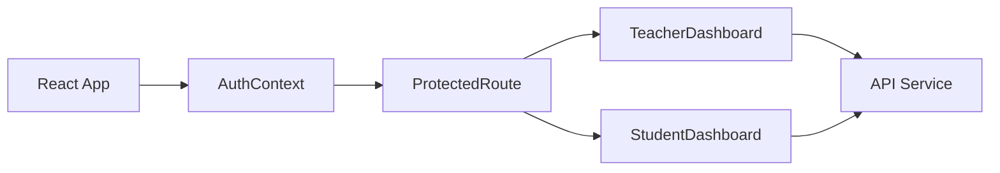

# Tailwebs - Assignment Workflow Portal (UI)

A modern, high-performance React application built with Vite and Tailwind CSS v4 to manage assignment workflows with a premium UX.

## ✨ Features

- **Role-Based Access**: Specialized dashboards for both **Teachers** and **Students**.
- **Teacher Portal**: Create, Publish, Edit, and Complete assignments. Review student submissions with analytic overviews.
- **Student Portal**: View published work, submit responses, and attach file metadata.
- **Responsive Design**: Mobile-first, glassmorphic UI using **Tailwind CSS v4** and **Framer Motion**.
- **Authentication**: Secure JWT-based login and registration flows.

## 🛠️ Tech Stack

| Technology | Purpose |
| :--- | :--- |
| **React 18** | UI Framework |
| **Vite** | Build Tool |
| **Tailwind v4** | Styling & Theme System |
| **Framer Motion** | Advanced Animations |
| **React Hook Form** | Form Management |
| **Lucide React** | Icon Suite |
| **Axios** | API Communication |

## 🏗️ Architecture



- **AuthContext**: Manages user session, token storage, and global authentication state.
- **ProtectedRoute**: Ensures only authenticated users with correct roles can access specific views.
- **Tailwind v4**: Uses a curated **Crimson Red** theme for a sleek, premium brand identification.

## ⚙️ Local Setup

1. **Install Dependencies**:
   ```bash
   npm install
   ```

2. **Environment Configuration**:
   Create a `.env` file in the root:
   ```env
   VITE_API_URL=http://localhost:5001/api
   ```

3. **Start Development Server**:
   ```bash
   npm run dev
   ```

## 🔑 Test Credentials

| Role | Email | Password |
| :--- | :--- | :--- |
| **Teacher** | `teacher@tailwebs.com` | `password` |
| **Student** | `student@tailwebs.com` | `password` |

*Note: You can also register a new account on the **Signup Page** to test dynamic user creation!*

## ⚠️ Assumptions & Constraints

- **Backend Dependency**: Requires the **Assignment Portal API** to be running on `localhost:5001`.
- **LocalStorage**: JWT tokens and user session data are stored in browser LocalStorage.
- **File Storage**: Currently simulates file uploads by storing metadata (`name`, `size`, `type`). No actual file upload occurs in this demo.
